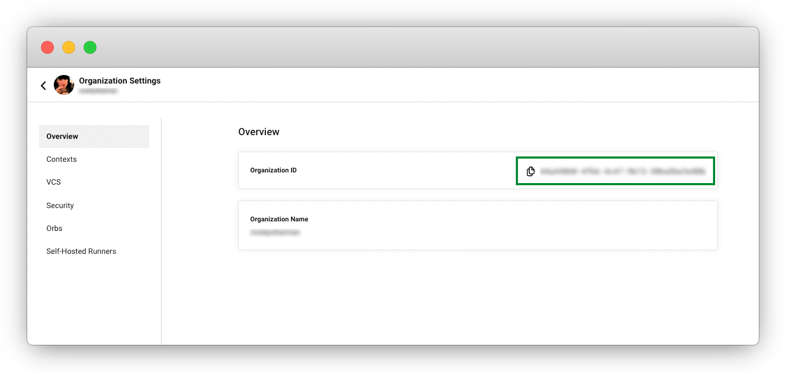
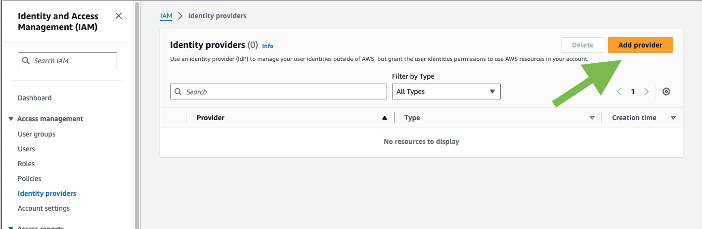
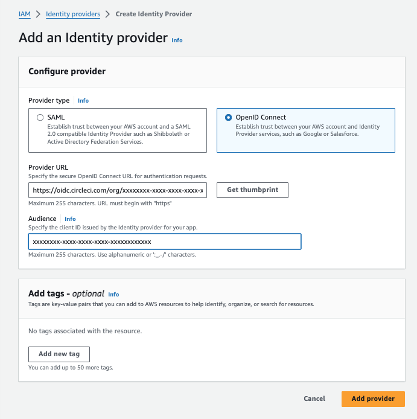

# Using AWS SageMaker Orb To Orchestrate Model Deployment Across Environments

## Pre-reqs

### Assumptions

* You have a model package in the SageMaker Studio Model Registry. We provide an easy way to train one - please see the `kitten_model` folder README AFTER you finish reviewing this document.
* You know how to setup an IAM OIDC provider and setup a trust relationship for a role.

### OIDC - Identity Provider

The Amazon SageMaker Orb uses OIDC. You need to setup an IAM > Identity Provider in your AWS IAM for CircleCI OIDC Provider.

Skip this section if you already have this setup.

First get your CircleCI Organization ID. Go to your Organization Settings in CCI and copy your Organization ID.



Now go to your AWS Management Console. Go to IAM > Access management > Identity providers. Select Add Provider.



Enter your Provider URL. Then click Thumbprint

**Provider URL**: Enter `https://oidc.circleci.com/org/<your-organization-id>`, where `your-organization-id` is the ID of your CircleCI organization.

**Audience**: Enter your organization ID



Click `Get Thumbprint` then `Add Provider`


Please see the guide on [Using OIDC tokens in jobs](https://circleci.com/docs/openid-connect-tokens/#aws) for deeper details.

### Role

You will need an IAM > Role with the following Permissions policy.

**Note**: We have organized the permissions into two groups. OrbPermissions and S3Access statements are used for the deployment of the model to the endpoints. The S3AccessTrainModel and SageMakerTrainModel statements are needed if you want to train the demo model we provide.

Update the S3 bucket information to match your setup.

```json
{
    "Version": "2012-10-17",
    "Statement": [
        {
            "Sid": "OrbPermissions",
            "Effect": "Allow",
            "Action": [
                "sagemaker:AddTags",
                "sagemaker:CreateEndpointConfig",
                "sagemaker:CreateModel",
                "sagemaker:DescribeEndpoint",
	 	        "sagemaker:DescribeEndpointConfig",
                "sagemaker:ListEndpoints",
                "sagemaker:ListModelPackages",
                "sagemaker:ListTags",
                "sagemaker:UpdateEndpoint",
                "iam:PassRole"
            ],
            "Resource": "*"
        },
        {
            "Sid": "S3Access",
            "Effect": "Allow",
            "Action": [
                "s3:GetObject",
                "s3:ListBucket"
            ],
            "Resource": [
                "arn:aws:s3:::circleci-sagemaker-pipeline/*"
            ]
        },
        {
            "Sid": "S3AccessTrainModel",
            "Effect": "Allow",
            "Action": [
                "s3:GetObject",
                "s3:ListBucket",
                "s3:PutObject"
            ],
            "Resource": [
                "arn:aws:s3:::sagemaker-sample-files/*",
                "arn:aws:s3:::circleci-sagemaker-pipeline",
                "arn:aws:s3:::circleci-sagemaker-pipeline/*"
            ]
        },
        {
            "Sid": "SageMakerTrainModel",
            "Effect": "Allow",
            "Action": [
                "sagemaker:CreateTrainingJob",
                "sagemaker:DescribeTrainingJob",
                "logs:DescribeLogStreams",
                "sagemaker:ListModelPackageGroups",
                "sagemaker:CreateModelPackage",
                "sagemaker:UpdateModelPackage"
            ],
            "Resource": "*"
        }
    ]
}
```

Then setup the Trust relationship between the Role and the CircleCI OIDC Provider. Here is an example Policy. **Note**: you must replace the placeholders `<CIRCLECI-ORG-ID>` and `<CIRCLECI-PROJECT-ID>` with your proper info.

```json
{
	"Version": "2012-10-17",
	"Statement": [
        {
            "Effect": "Allow",
            "Principal": {
                "Federated": "arn:aws:iam::<AWS-ACCOUNT-ID>:oidc-provider/oidc.circleci.com/org/<CIRCLECI-ORG-ID>"
            },
            "Action": "sts:AssumeRoleWithWebIdentity",
            "Condition": {
                "StringLike": {
                    "oidc.circleci.com/org/<CIRCLECI-ORG-ID>:sub": "org/<CIRCLECI-ORG-ID>/project/<CIRCLECI-PROJECT-ID>/user/*"
                }
            }
        },
        {
			"Effect": "Allow",
			"Principal": {
				"Service": "sagemaker.amazonaws.com"
			},
			"Action": "sts:AssumeRole"
		}

    ]
}
```

### Required Environment Variables

There are some required Environment Variables for the orb to function. Please configure these at either the Project level or using Org Contexts. [Guide on setting Environment Variables in CircleCI](https://circleci.com/docs/set-environment-variable/).

`SAGEMAKER_EXECUTION_ROLE_ARN` (required): This is the role you have configured with the necessary SageMaker permissions, and has the OIDC Trust relationship setup.

`CCI_RELEASE_INTEGRATION_TOKEN` (optional): The Orb also allows integration with [CircleCI Releases](https://app.circleci.com/releases). This will give you visibility into the Endpoint Configuration Updates, and what is currently active. To make a Release Integration Token please see our [Onboarding Guide](https://circleci.com/docs/release/set-up-a-release-environment/). [TODO Updated guide that mentions making the SageMaker Release Integration]

## Orb Parameters

`bucket` - This is the S3 bucket where resources will be stored.

`deploy_environment` - The name of the environment you are working with. This is an arbitrary string that works for how you like to organize your model deploys. Can be 'dev' or 'prod', for example.

`model_desc` - A description for the model to be deployed.

`model_name` - The name of the model in SageMaker that we will be deploying.

`circle_pipeline_id` - The pipeline.id is ued as a unique identifier for some of the configurations we create. Format: << pipeline.id >>

`circle_project_id` - Found in the Project Settings in CircleCI. Used for specifying the project that triggered this deployment.

`region_name` - The aws region where the deployment is to happen. eg: `us-east-1`

For full range of options, consult the circleci/aws-sagemaker orb [documentation](https://circleci.com/developer/orbs/orb/circleci/aws-sagemaker#jobs).

## Support

Stuck? Need help? Visit our [forums](https://discuss.circleci.com/), contact us directly at [sagemaker-integration-feedback@circleci.com](mailto:sagemaker-integration-feedback@circleci.com), or come visit on [Discord](https://discord.com/invite/UWsWB44zYj).

