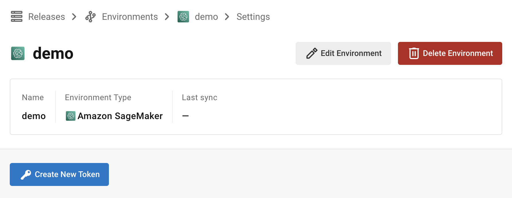
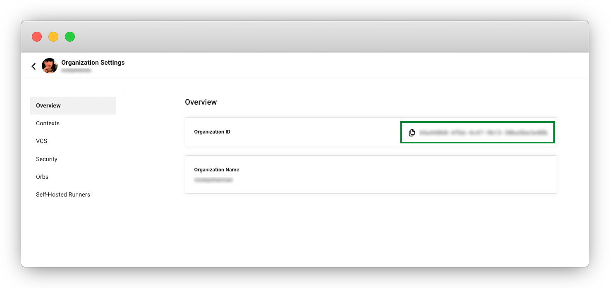

# Using AWS SageMaker Orb To Orchestrate Model Deployment Across Environments

Hi! This tutorial covers:

* Setting up a Release Integration Token
* Setting up SageMaker Access for your workflow
* Environment Variables
* Models
* Deploying model to SageMaker using the Orb
* Conclusion

The focus of this article is to illustrate how to use the [AWS SageMaker Orb](https://circleci.com/developer/orbs/orb/circleci/aws-sagemaker) to orchestrate model deployment to endpoints across your environments. The example project repository allows you to train a new model package version and then deploy it across multiple environments.

You can find the code for the tutorial in [this](https://github.com/CircleCI-Public/sagemaker-deploy-examples) Github repository.

## Setting up a Release Integration Token

Navigate to the **Releases** section. Select **Add Release Environment**.


Select `Amazon SageMaker`, add a Name and Create Enviroment.


Select your Environment:


And click on **Create New Token**.



Make sure to save your kry for later - we'll pop it into an environment variable.

## Setting up Amazon SageMaker access

### OIDC - Identity Provider

The Amazon SageMaker Orb uses OIDC. if you are not familiar with setting that up, no worries! Let's walk through it.

Skip this section if you already have this setup.

First we create an IAM > Identity Provider in your AWS IAM for CircleCI OIDC Provider.

Get your CircleCI Organization ID. Go to your Organization Settings in CCI and copy your Organization ID.



Now go to your AWS Management Console. Go to IAM > Access management > Identity providers. Select Add Provider.


Enter your Provider URL. Then click Thumbprint

**Provider URL**: Enter `https://oidc.circleci.com/org/<your-organization-id>`, where `your-organization-id` is the ID of your CircleCI organization.

**Audience**: Enter your organization ID


Click `Get Thumbprint` then `Add Provider`

If you are interested in more details around our OIDC functionality, see the guide on [Using OIDC tokens in jobs](https://circleci.com/docs/openid-connect-tokens/#aws) for a deeper dive.

Next, let's tackle making a Role.

### Role

You will need an IAM > Role with the following Permissions policy.

**Note**: We have organized the permissions into two groups. OrbPermissions and S3Access statements are used for the deployment of the model to the endpoints. The S3AccessTrainModel and SageMakerTrainModel statements are needed if you want to train the demo model we provide.

Update the S3 bucket information to match your setup. (That means create a bucket if one doesn't exist!)

```json
{
    "Version": "2012-10-17",
    "Statement": [
        {
            "Sid": "OrbPermissions",
            "Effect": "Allow",
            "Action": [
                "sagemaker:AddTags",
                "sagemaker:CreateEndpointConfig",
                "sagemaker:CreateModel",
                "sagemaker:DescribeEndpoint",
	 	        "sagemaker:DescribeEndpointConfig",
                "sagemaker:ListEndpoints",
                "sagemaker:ListModelPackages",
                "sagemaker:ListTags",
                "sagemaker:UpdateEndpoint",
                "iam:PassRole"
            ],
            "Resource": "*"
        },
        {
            "Sid": "S3Access",
            "Effect": "Allow",
            "Action": [
                "s3:GetObject",
                "s3:ListBucket"
            ],
            "Resource": [
                "arn:aws:s3:::<BUCKET_FOR_MODEL_ASSETS>/*"
            ]
        },
        {
            "Sid": "S3AccessTrainModel",
            "Effect": "Allow",
            "Action": [
                "s3:GetObject",
                "s3:ListBucket",
                "s3:PutObject"
            ],
            "Resource": [
                "arn:aws:s3:::sagemaker-sample-files/*",
                "arn:aws:s3:::circleci-sagemaker-pipeline",
                "arn:aws:s3:::circleci-sagemaker-pipeline/*"
            ]
        },
        {
            "Sid": "SageMakerTrainModel",
            "Effect": "Allow",
            "Action": [
                "sagemaker:CreateTrainingJob",
                "sagemaker:DescribeTrainingJob",
                "logs:DescribeLogStreams",
                "sagemaker:ListModelPackageGroups",
                "sagemaker:CreateModelPackage",
                "sagemaker:UpdateModelPackage"
            ],
            "Resource": "*"
        }
    ]
}
```

Then setup the Trust relationship between the Role and the CircleCI OIDC Provider. Here is an example Policy. **Note**: you must replace the placeholders `<CIRCLECI-ORG-ID>` and `<CIRCLECI-PROJECT-ID>` with your proper info.

```json
{
	"Version": "2012-10-17",
	"Statement": [
        {
            "Effect": "Allow",
            "Principal": {
                "Federated": "arn:aws:iam::<AWS-ACCOUNT-ID>:oidc-provider/oidc.circleci.com/org/<CIRCLECI-ORG-ID>"
            },
            "Action": "sts:AssumeRoleWithWebIdentity",
            "Condition": {
                "StringLike": {
                    "oidc.circleci.com/org/<CIRCLECI-ORG-ID>:sub": "org/<CIRCLECI-ORG-ID>/project/<CIRCLECI-PROJECT-ID>/user/*"
                }
            }
        },
        {
			"Effect": "Allow",
			"Principal": {
				"Service": "sagemaker.amazonaws.com"
			},
			"Action": "sts:AssumeRole"
		}

    ]
}
```

Go copy the Role ARN . We'll need that next.

## Environment Variables

There are some required Environment Variables for the orb to function. Which is exactly what we want! So let's go add them.

Go to your project’s settings, click Environment Variables, then click the Add Variable button to enter a name and value of the new environment variable. The Orb will use these when you run the workflow. [Guide on setting Environment Variables in CircleCI](https://circleci.com/docs/set-environment-variable/).


`SAGEMAKER_EXECUTION_ROLE_ARN` This is the role you have configured with the necessary SageMaker permissions, and has the OIDC Trust relationship setup.

`CCI_RELEASE_INTEGRATION_TOKEN` The Orb also works with [CircleCI Releases](https://app.circleci.com/releases). This will give you visibility into the Endpoint Configuration Updates, and what is currently active.

## Setting up our config.yml

Now we [go look](https://github.com/CircleCI-Public/sagemaker-deploy-examples/blob/7db4387cbd72a5fa1b50592c744389054ab2def0/.circleci/config.yml#L7) at our `.circleci/config.yml` and set some paramters. You will update the defaults for each parameter.

```yml
parameters:
  bucket:
    type: string
    default: <BUCKET_FOR_MODEL_ASSETS> # You set this up in the Role Policy
  model_desc:
    type: string
    default: "<Description about your Model.>"
  model_name:
    type: string
    default: <MODEL_NAME> # This is the name of the model, model package.
  project_id:
    type: string
    default: "<CIRCLECI_PROJECT_ID>" #found on the Project Settings page in CCI
  region_name:
    type: string
    default: <REGION> #eg: us-east-1
```

## Models

For this tutorial, we’ve taken a model commonly found in AWS documentation, Abalone, and rename it.

You too can have this model! Assuming you using our [example repo](https://github.com/CircleCI-Public/sagemaker-deploy-examples), we have a workflow configured to run on the branch `model-train`. So create that branch, push it up to git, and this workflow will create a new model package version in the model registry. If the model package doesn't already exist, it will create it.

Every time you run this workflow, it will create a new model version.

## Using the orb

Let's break down the `deploy-model-through-to-prod` workflow. Our first job is:

```
- aws-sagemaker/create_model:
    # job name that will show in Workflow DAG
    name: create-model
    # s3 bucket where asset will be stored
    bucket: << pipeline.parameters.bucket >>
    # Name of the model in SageMaker that we will be deploying.
    model_name: << pipeline.parameters.model_name >>
    # We use the pipeline.id as the unique identifier for some of the configs we create
    pipeline_id: << pipeline.id >>
    # Region where we are deploying to
    region_name: << pipeline.parameters.region_name >>
    filters: *main-branch-only
```

This step goes and creates a model from your latest Model Package in the registry. This will be what we then delpoy to the inference endpoints.

Some things to notice: Aside from the `name` and the `filters` all the other parameters are passed in from our pipeline parameters.


`name` controls the name of this job on the DAG.
`filters` allows you to control what branch the job runs on.

In general, `create-model` just needs to be called the one time at the beginning of your workflow.

Next, we have to create the endpoint configuration. Lucky us! We have a command for that too!

```yml
- aws-sagemaker/create_endpoint_configuration:
    name: dev:create-model-endpoint-config
    bucket: << pipeline.parameters.bucket >>
    deploy_environment: dev
    model_name: << pipeline.parameters.model_name >>
    pipeline_id: << pipeline.id >>
    region_name: << pipeline.parameters.region_name >>
    requires:
        - create-model
    filters: *main-branch-only
```

Aha! A new parameter enters the battle - `deploy_environment`. This is basically an arbitrary string you can use to bucket your model releases into. eg: dev, staging, testing, prod. All valid. In our example config, you can see we are only using 2 - dev & prod.

Last but not least, we need to push out this updated configuration.

```yml
    - aws-sagemaker/deploy_endpoint:
        name: dev:deploy-model-to-endpoint
        bucket: << pipeline.parameters.bucket >>
        deploy_environment: dev
        model_name: << pipeline.parameters.model_name >>
        # Description for the model. q: can we make it optional?
        model_desc: << pipeline.parameters.model_desc >>
        pipeline_id: << pipeline.id >>
        # You can find this value in the Project Settings in CircleCI
        project_id: << pipeline.parameters.project_id >>
        region_name: << pipeline.parameters.region_name >>
        requires:
            - dev:create-model-endpoint-config
        filters: *main-branch-only
```

No surprises here, we have a `aws-sagemaker/deploy_endpoint` job in the orb. The only thing to set here is also the `deploy_environment` so we know what endpoint_configuration to use. This will deploy your endpoint configuration. You can go keep an eye on it in the Releases to see how its going.


We then throw in an approval job, which will stop our workflow from deploying to production, without a human approving it.

```yml
- promote-model-to-prod-endpoint:
        type: approval
    requires:
        - dev:deploy-model-to-endpoint
    filters: *main-branch-only
```

At which point, we then repeat the above steps of `aws-sagemaker/create_endpoint_configuration` and `aws-sagemaker/deploy_endpoint` but with `deploy_environment` set to `prod`.


## Support

Stuck? Need help? Visit our [forums](https://discuss.circleci.com/), contact us directly at [sagemaker-integration-feedback@circleci.com](mailto:sagemaker-integration-feedback@circleci.com), or come visit on [Discord](https://discord.com/invite/UWsWB44zYj).

